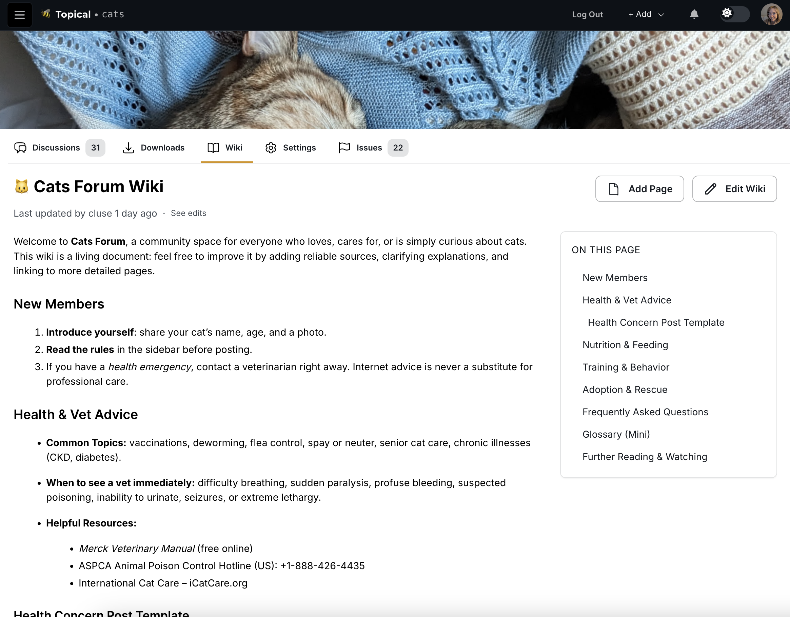
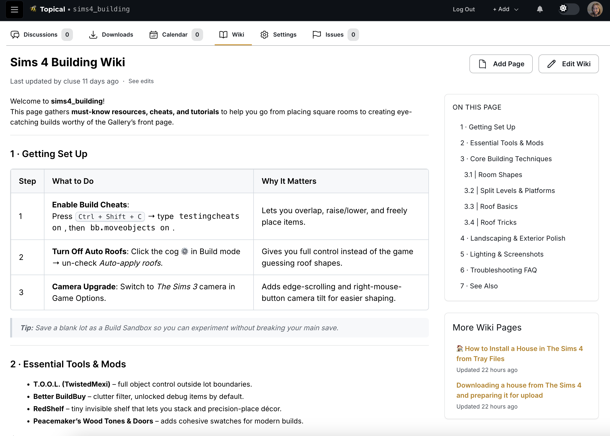
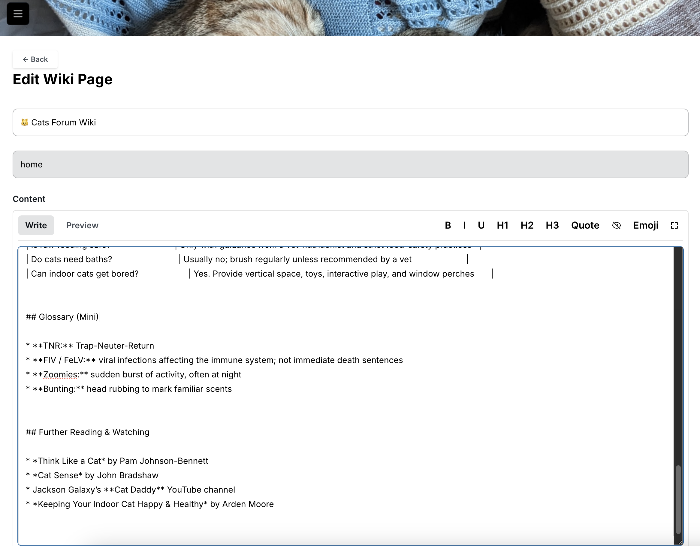
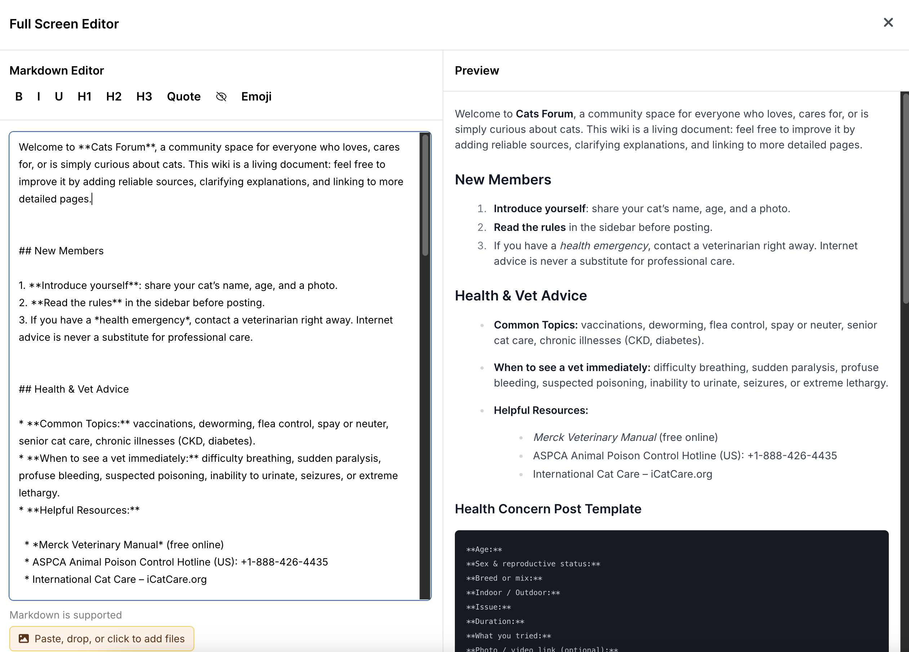
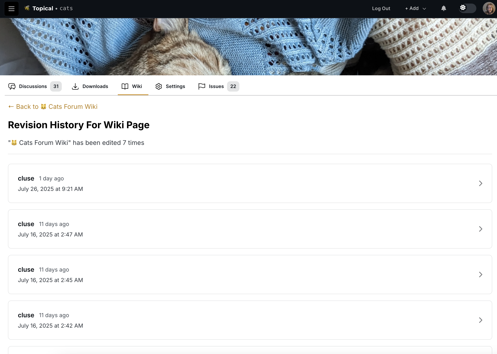
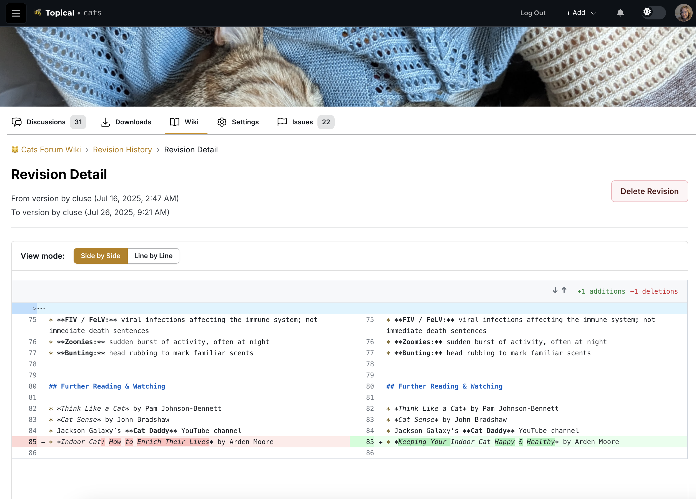

# Multiforum

Multiforum is an online platform for communities to create forums for sharing discussions and events. Key features:

1. Each forum has three main sections:
  - Discussions: Content can be upvoted so best content rises to top
  - Calendar: Calendar with upcoming community events
  - Wikis: Wiki tab with shared knowledge base
2. Cross-posting capability:
  - Events and discussions can be submitted to multiple forums for increased visibility
3. Location-based event discovery:
  - Map integration shows events across forums
  - Events can be filtered by proximity, time, tags, and forums
4. Responsive design:
  - Works on both desktop and mobile
5. Technology stack:
  - Frontend: Vue/Nuxt.js with Apollo client
  - Backend: Apollo server with Neo4j graph database
  - Authentication: Auth0
  - Maps: Google Maps integration

This is a work in progress that intended to be an open-source, self-hosted platform.

## Video Demo

Note: The screenshots below are more recently updated than the video.

## Overview

Each forum has three main sections that enable different types of community interaction:

**Discussions**: A social content system where community members can share posts, ask questions, and engage in conversations. Content can be upvoted so that the best contributions rise to the top, helping surface the most valuable information for the community.

**Calendar**: A collaborative event management system where anyone can post events that community participants may be interested in. Events can be submitted to multiple forums simultaneously to increase visibility and help with promotion.

**Wikis**: A collaborative knowledge base system where community members can create, edit, and maintain shared documentation. Each wiki page includes full revision history, allowing users to track changes over time and compare different versions using a built-in diff viewer. Forum owners can enable or disable the wiki feature based on their community's needs.

All content types (discussions, events, and wiki pages) support cross-posting capabilities, allowing content to be shared across multiple forums to maximize reach and engagement.

For location-based communities, the platform includes powerful discovery features: events can be searched across multiple forums based on location, tags, and keywords, solving the common problem of not knowing what activities are available in your area.

When the project is finished, documentation will be added so that anyone can deploy their own Multiforum instance with custom branding.

## New feature July 2025 - Wikis

I added a wiki feature. Forum owners can go into the forum settings and select a checkbox to enable the wiki. That turns on a Wiki tab.

Here's an example of a wiki with a single page:

Here's a wiki with multiple pages - see there's a box that lists other pages:

Here's how it looks when you edit a wiki page:

Here's how it looks when you edit a wiki page in full screen mode (after clicking the box in the top right of the text editor):

If you click 'see edits' you can see the revision history of a wiki page:

If you click a revision you can see the diff that shows what was edited:

## Screenshots - Desktop width

The below screenshots capture the state of the project as of January 2025. The layout is responsive with both desktop and mobile views.

### Sitewide event search - filtering by time

Here's how it looks if you filter all in-person events by 'next month':

### Highlighting events on the map

If you mouse over an event list item or map marker, an info window pops up on the map
and the list item is also highlighted. This is supposed to make it easier to draw a connection
between the two:

If you click the map marker, more details about the event show up:

### Filtering the map by forums

If I'm only interested in events from a few specific forums, I filter the 
map by those forums:

The resulting event list is now filtered by the two forums I selected - the free events group
and the family-friendly one. All of the concerts are no longer in the list and their map
markers are no longer on the map:

### Clicking forum name in event drawer

If you're looking at events from the map view, and you click on one, the details
will show up in a drawer:

In that drawer you can see what forums that event was
submitted to. If you click the forum name it will take you to the event page in
the context of that forum:

Screenshots of event detail pages within a forum are below.

### Multiple events at the same location

Some map markers indicate that there are multiple events at the same location. If
you click that, you can see the list of events that are taking place there at different times:

### Event list within a forum

Each forum can have its own list of upcoming events. In this example, a forum about
rock music in Phoenix is promoting events at multiple venues. Meanwhile, the
forum sidebar shows the handful of events which are coming up the soonest, so that
they are visible even when the Discussions tab is active:

(Note: The above screenshot is a little outdated but the sidebar still shows events in this format.)

Events can be filtered within a forum.Here are the events filtered by location. In this case they are filtered to show
events within 5 miles of Tempe:

### Discussion list within a forum

A birdwatching forum is an example of a forum that could make use of both in-person events
and online discussions with people who may never attend any events. For example, someone
who takes a picture of an unfamiliar bird in Phoenix might ask the Phoenix birdwatchers what it is.
That's when the Discussions tab within a forum would come in handy:

### Discussion detail

If you click an item in the discussion list, it goes to the discussion detail view, which contains
the comments. In the case of a birdwatching group, maybe there's a comment identifying the bird:

### Forum without any events

Events are optional for forums. I intend to make it possible for a forum to turn
off the events tab. The Discussions tab is the main landing page, especially for forums
that could be focused on technical questions and answers, which would
have no need for events:

### Submitting an event to forums

You can share an event to one or more forums. In a typical use case, you would link to an official
event page with the full details and information about how to buy tickets, if applicable.

Submitting an event to multiple forums is a good way to increase the visibility of the event. This one will now be visible in the context of both of the selected forums:

If you add an address, the event will be discoverable from the sitewide event search page (the map view):

### Recently visited forums

If you click the menu button on the top left of any page, it shows recently visited forums
to support easy context switching.

## Screenshots - Mobile width

### Discussion list views within a forum

Here's the discussion list within a single forum, at mobile width:

Here's another example of a discussion list view at mobile width:

### Event list view within a forum

Here's the list of events within a specific forum:

### Event detail page

This screenshot shows how an event detail page looks at mobile width, if you
come to it from within the context of an individual forum:

### Discussion detail page

This screenshot shows how a discussion detail page looks at mobile width, if
you come to it from within the context of an individual forum:

### Sitewide event list

Here's the sitewide in-person event list with an active filter,
shown here at mobile width. All the same filtering features work at mobile width
as well. Here, the events are filtered by the birdwatching forum,
so not all of the map markers are displayed.

### List of all forums

Here is the list of forums at mobile width:

The list of forums can be filtered by tag:

The forum list can be filtered by search terms as well:

## Technology Stack

On the backend (https://github.com/gennit-project/multiforum-backend), an Apollo server fetches data from the database (a graph database, Neo4j). Some resolvers are auto-generated using the [Neo4j graphql library](https://neo4j.com/docs/graphql/current/), while more complex resolvers are implemented using a combination of the [OGM](https://neo4j.com/docs/graphql/current/ogm/) and custom Cypher queries.

The frontend is a Vue application that makes GraphQL queries to the Apollo server.

## Authentication System

Multiforum uses a hybrid authentication system that combines Auth0 for secure authentication with SSR-compatible auth hints for optimal user experience.

### SSR Auth State Management

To prevent UI flash and hydration issues, the application uses a two-layer authentication approach:

1. **Auth Hint Cookies (SSR-compatible)**
   - Non-sensitive cookies that indicate whether a user is logged in
   - Can be read during Server-Side Rendering (SSR) for immediate auth state
   - Ensures server and client render the same initial state
   - Prevents the brief "blackout" flash when switching between auth states

2. **Secure Auth Tokens (Client-side)**
   - JWT tokens stored in localStorage for secure API calls
   - Contains full user authentication data
   - Used for actual authorization and API requests

### How It Works

1. **Login Flow**:
   - User authenticates through Auth0
   - Auth hint cookie is set (indicates "logged in" state)
   - Auth token is stored in localStorage
   - User data is fetched and cached

2. **SSR Rendering**:
   - Server reads auth hint cookies during SSR
   - Renders appropriate UI state (logged in vs logged out)
   - Client hydrates with matching state, preventing flash

3. **Client-side Operation**:
   - App checks for auth tokens in localStorage
   - Makes authenticated GraphQL requests
   - Maintains reactive auth state throughout the session

4. **Logout Flow**:
   - Auth hint cookies are cleared
   - localStorage tokens are removed
   - User is redirected to appropriate page

### Key Components

- **`useSSRAuth` composable**: Manages auth hint cookies and SSR state
- **`useAuthManager` composable**: Handles secure auth tokens and user data
- **`RequireAuth` component**: Conditionally renders content based on auth state
- **Auth hint cookies**: `isLoggedIn`, `username`, `modProfileName`

### Important Implementation Details

**Cookie Synchronization Requirements:**
- Auth hint cookies MUST be updated whenever auth state changes
- Both login and logout flows must clear/set cookies consistently
- GraphQL user data fetching should also update auth hints for consistency

**SSR vs Client-side State:**
- SSR uses ONLY auth hint cookies (no localStorage access)
- Client-side uses BOTH cookies and localStorage tokens
- The `RequireAuth` component handles this dual-state checking automatically

**Testing Considerations:**
- Test auth flows in SSR mode (disable JavaScript) to verify server rendering
- Test with cleared cookies to ensure proper fallback behavior
- Verify no hydration mismatches between server and client rendering

**Common Pitfalls to Avoid:**
- Don't add auth token logic to SSR-rendered components
- Don't rely on localStorage during initial render
- Always update auth hints when modifying auth state
- Ensure cookie domain/path settings work across all deployment environments

### Debugging Auth Issues

1. **UI Flash Problems**: Check if auth hint cookies match actual auth state
2. **Hydration Errors**: Verify server and client render identical initial state  
3. **Login/Logout Issues**: Ensure all auth state updates include cookie synchronization
4. **Missing Auth UI**: Check both cookie and localStorage token presence

### Benefits

- **No UI Flash**: Server and client render identical initial state
- **SEO Friendly**: Public content is fully visible to search engines
- **Fast Loading**: No loading states that delay content visibility
- **Secure**: Sensitive data remains in secure client-side storage
- **Reliable**: Handles edge cases like expired tokens gracefully

## Performance Optimizations

We have implemented several performance optimizations to improve load times, reduce bandwidth usage, and enhance the user experience. See [PERFORMANCE.md](./PERFORMANCE.md) for details on:

- Code splitting and lazy loading
- Text compression and caching
- JavaScript and CSS minification
- Image optimization
- Server response time improvement

## Environment Variables

The application requires several environment variables to be set up. For a comprehensive list of environment variables with detailed descriptions, see the [Environment Variables section in CONTRIBUTING.md](CONTRIBUTING.md#environment-variables).

### Development Setup
1. Create a `.env` file in the root directory
2. Copy the variables from `.env.example` (if available)
3. Fill in your values for each required variable
4. Never commit the `.env` file to version control

### Docker Setup
When using Docker Compose, these variables can be set in the environment or in a `.env` file. The `docker-compose.yml` file includes default values for some variables:
- `NEO4J_AUTH`: defaults to "neo4j/neo4j"
- `NEO4J_PASSWORD`: defaults to "neo4j"
- `NEO4J_USERNAME`: defaults to "neo4j"
- `VITE_SERVER_NAME`: title of the app
- `VITE_BASE_URL`: defaults to "http://localhost:3000"
- `VITE_GRAPHQL_URL`: defaults to "http://localhost:4000"
- `VITE_ENVIRONMENT`: defaults to "development"

## Tests

Integration tests are in the `cypress` directory