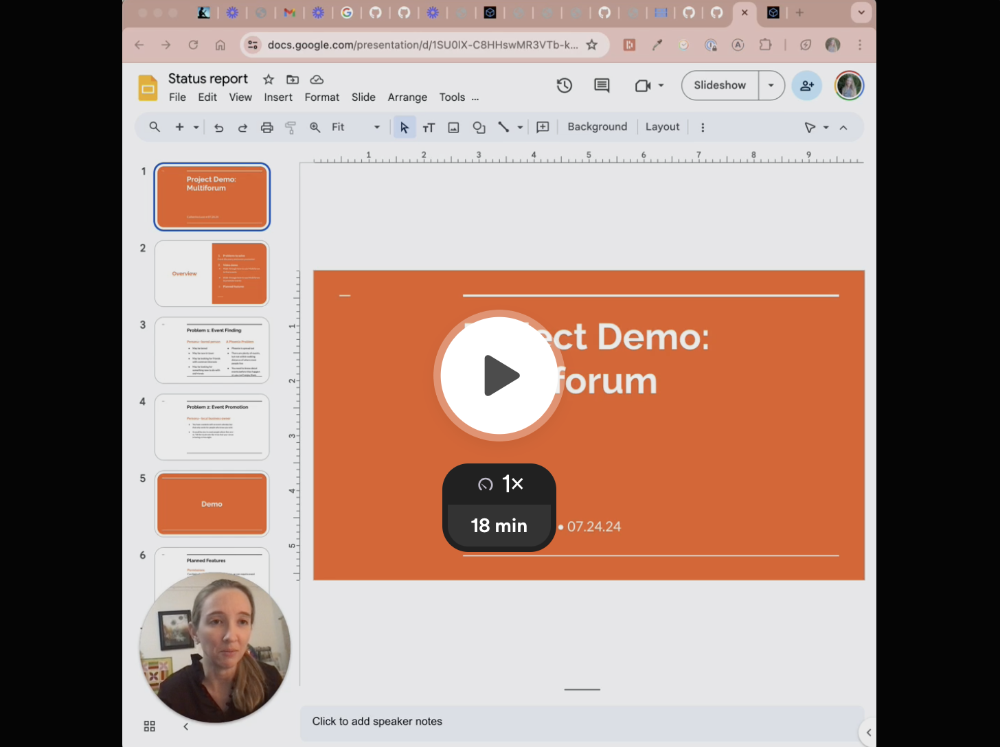

# Multiforum

Multiforum is an online platform for communities to run forums with discussions, events, and shared knowledge.

## What It Includes

- **Discussions**: upvotable community posts and comment threads
- **Calendar**: event posting and discovery
- **Wikis**: collaborative docs with revision history and diff views
- **Cross-posting**: events and discussions can be shared to multiple forums
- **Map-based discovery**: browse/filter events by location, tags, time, and forum
- **Responsive UI**: desktop and mobile support

## Video Demo

Note: screenshots are more recently updated than the video.

[](https://www.loom.com/share/c94dcfcad181448abf6501584e01f9d2?sid=5d53630c-813f-4cfe-bb22-1d7289effc2e)

## Quick Start

```bash
npm install
npm run dev
```

## Documentation

- [Development setup](./docs/development-setup.md)
- [Architecture and authentication](./docs/architecture-and-auth.md)
- [Feature updates (2025)](./docs/feature-updates.md)
- [Screenshots gallery](./docs/screenshots.md)
- [Contributing guide](./CONTRIBUTING.md)
- [Performance details](./PERFORMANCE.md)
- [Developer workflow and standards](./CLAUDE.md)

## Technology Summary

- **Frontend**: Vue/Nuxt + Apollo Client
- **Backend**: Apollo Server + Neo4j
- **Authentication**: Auth0 + SSR auth hint cookies
- **Maps**: Google Maps

## Status

This project is in active development.
