# Feature Updates

## September 2025: Downloads and Custom Filters per Forum

These features are still in progress, but this update captures current work on forum-scoped downloads and filters.

The platform vision is to combine:
- Downloadable files in niche subject areas (for example ebooks or game mods)
- A nearby wiki where beginners can learn how to make similar creations

This requires stronger navigation, organization, and security around shared files. One major piece is forum-specific filters for downloads.

In this `sims4_builds` example forum, users can filter downloads by lot type and lot size.

Applying the `Residential` filter updates results in place.

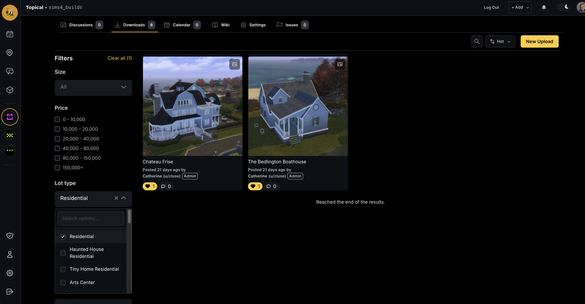

Applying two filters narrows results further (for example `Residential` + `20x20`).

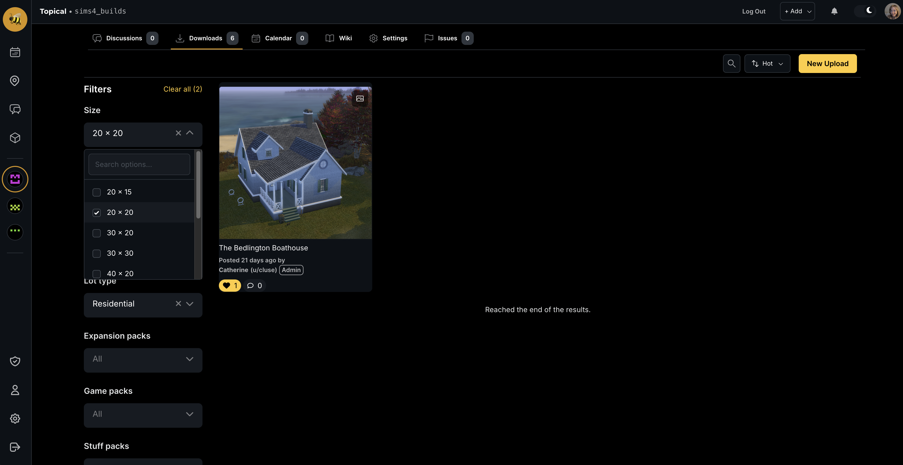

These filters correspond to labels shown on each download detail page.

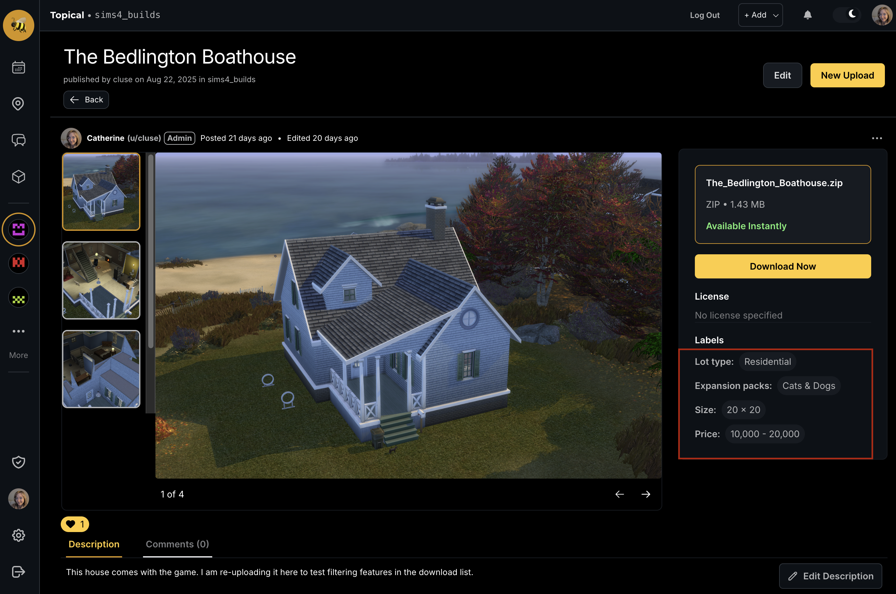

Filters are configured per forum in settings:

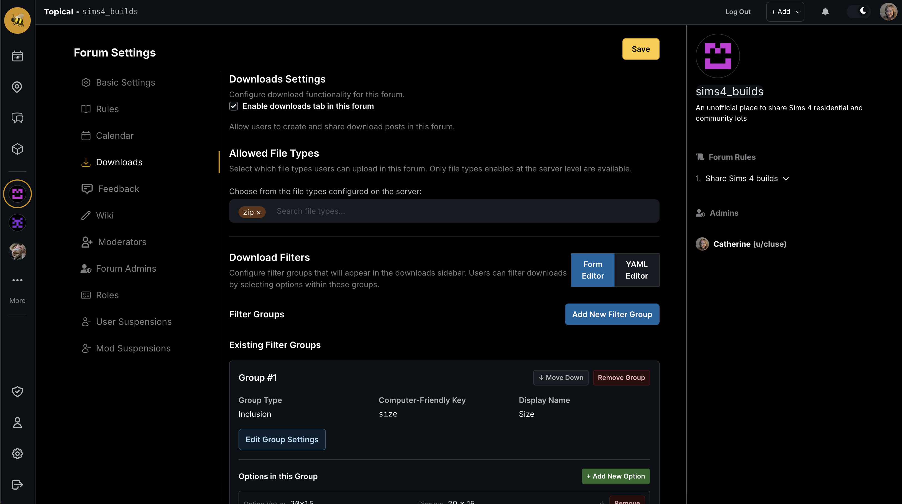

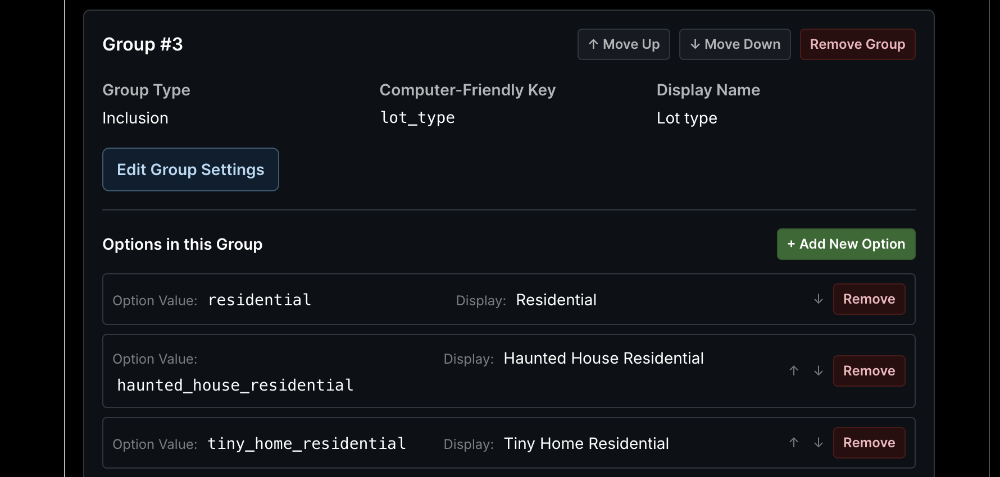

At the moment, labels are applied manually via form input. Work is in progress on an admin-enabled, forum-scoped auto-labeler so filtering metadata can be applied automatically.

## August 2025: Map Marker Clustering

The Google Maps Marker Clusterer was added to reduce visual noise when many events are displayed.

Before:

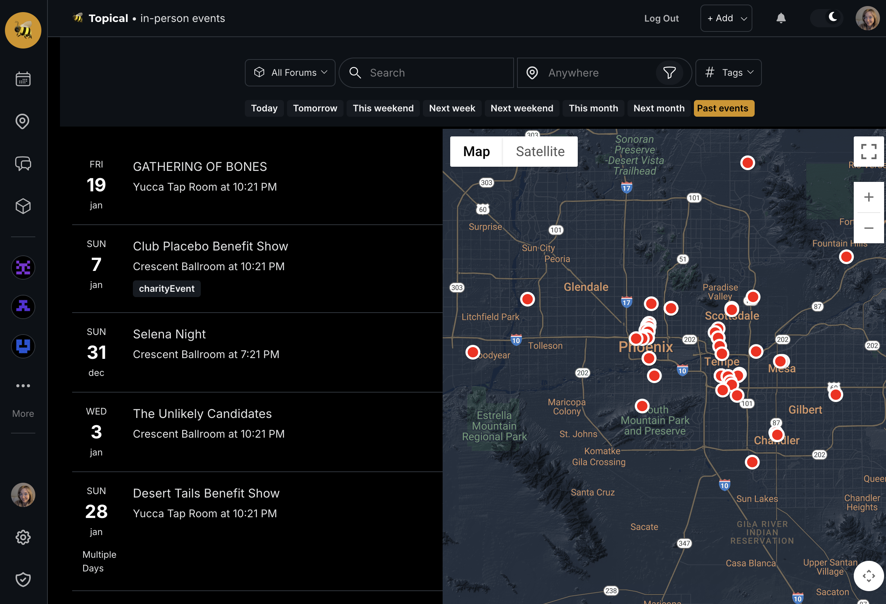

After:

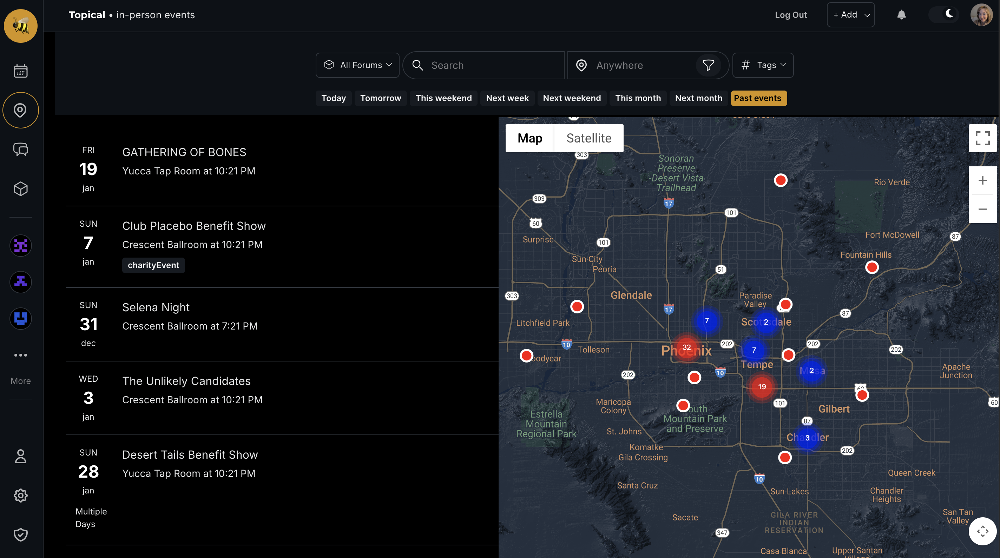

## July 2025: Wikis

A wiki feature was added. Forum owners can enable wiki support from forum settings, which shows a Wiki tab.

Single-page wiki example:

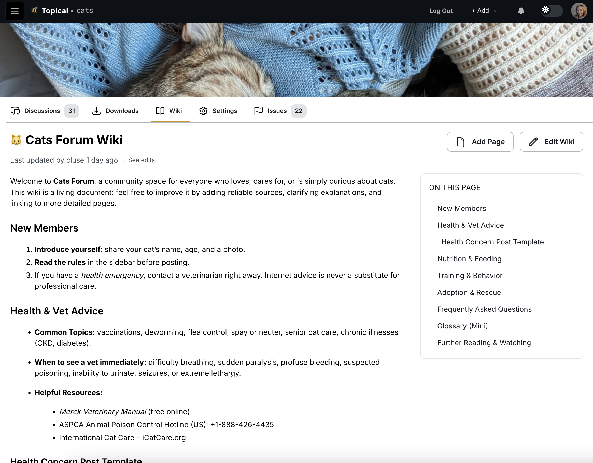

Multi-page wiki example:

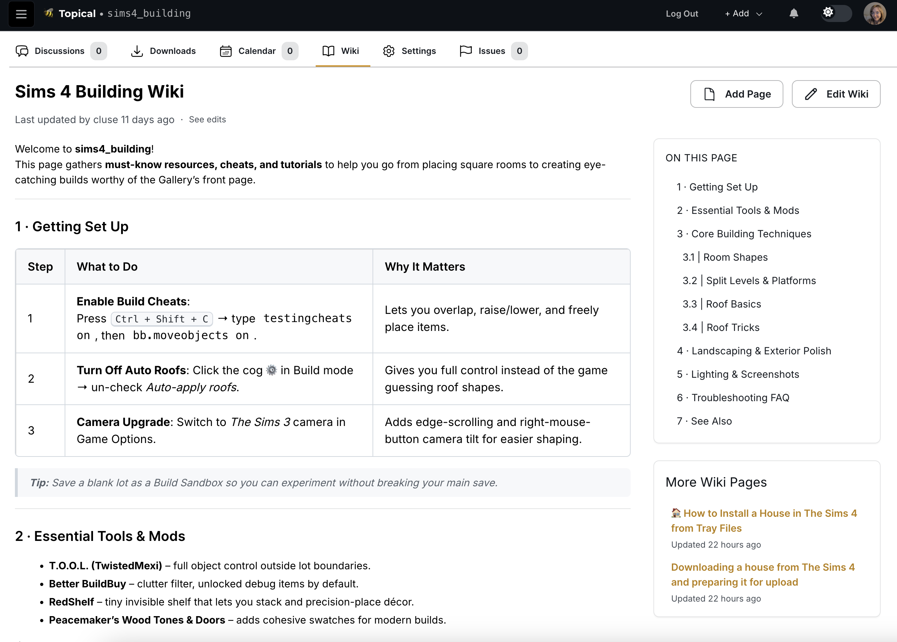

Editing a wiki page:

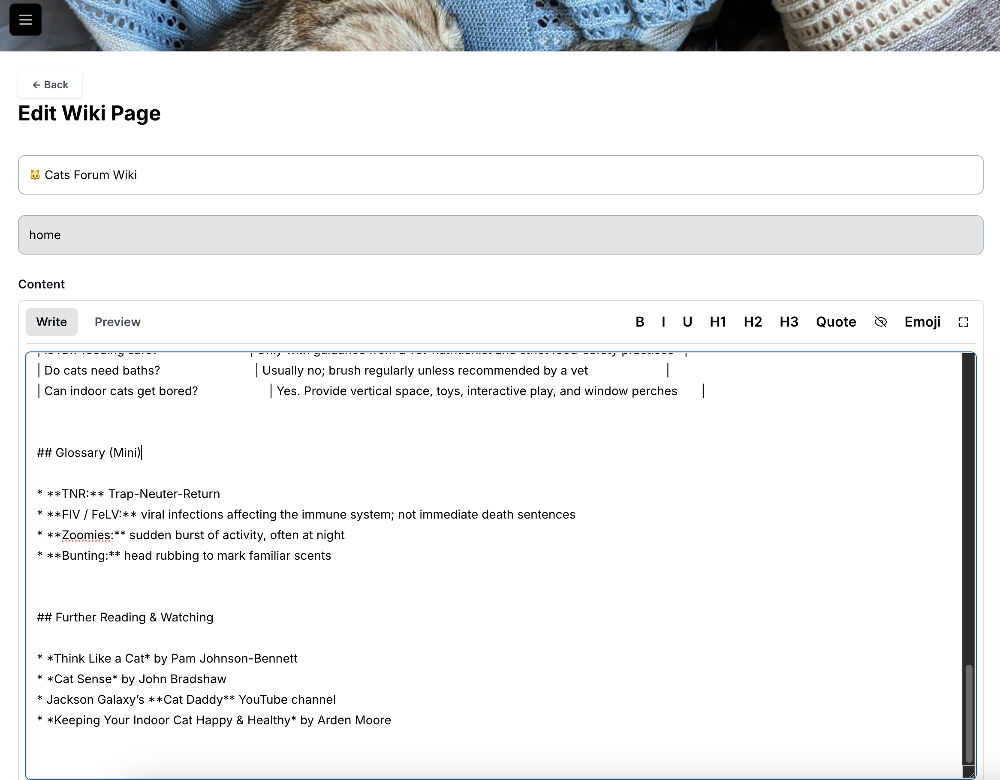

Fullscreen wiki editing:

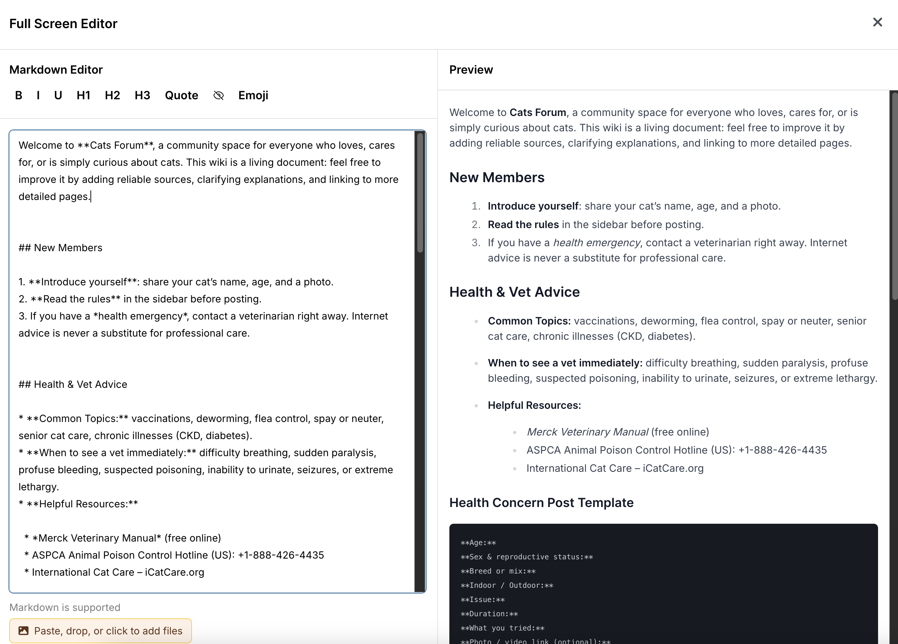

Revision history view:

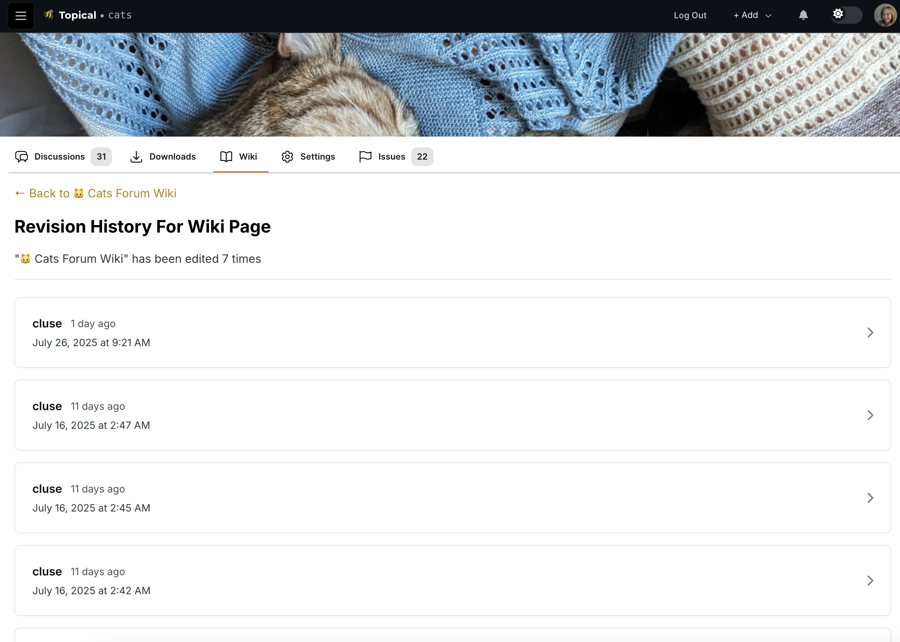

Diff view between revisions:

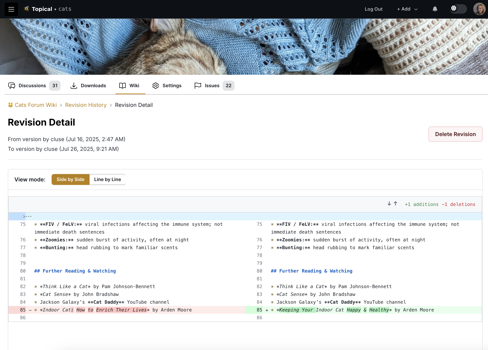
